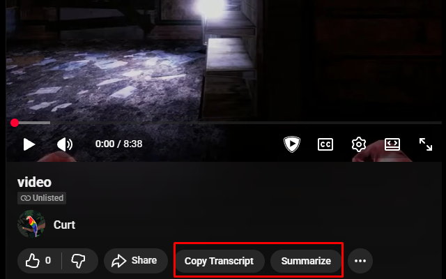

# StopYappingBro

Chrome extension that grabs a YouTube video's transcript and hands it to ChatGPT for a concise summary — so you can get the gist without sitting through the yapping.



## What it's for

- Summarizing long YouTube videos (lectures, talks, podcasts, reviews) in seconds
- Copying a clean, plain-text transcript to your clipboard for notes or search
- Sending the transcript straight into a fresh ChatGPT conversation with your own prompt prefilled

It does not host its own AI — it drives the ChatGPT web app you already use, in your own logged-in session.

## Install

Until the extension is published to the Chrome Web Store, load it unpacked:

1. Build the extension: `npm install && npm run build` (output lands in `.output/chrome-mv3`).
2. Visit `chrome://extensions`
3. Enable Developer Mode (top right)
4. Click "Load unpacked"
5. Select the `.output/chrome-mv3` folder

## Usage

1. Open any YouTube video at a `youtube.com/watch` URL.
2. Two buttons appear in the video's action bar (next to Like / Share):
   - **Copy Transcript** — extracts the transcript and copies it to your clipboard.
   - **Summarize** — extracts the transcript, opens a new ChatGPT tab, prefills the composer with your prompt followed by the transcript, and submits it automatically.
3. If the transcript hasn't loaded yet, the extension clicks YouTube's "Show transcript" control for you and waits for it to arrive.

The summarization prompt defaults to:

> Summarize this YouTube transcript extremely concisely:

You can override it; the custom prompt is saved in `chrome.storage.local` (see [Storage](#storage)).

## How it works

YouTube fetches transcripts through one of two internal APIs (`get_panel` or `get_transcript`). The extension:

1. Runs a MAIN-world content script (`src/entrypoints/youtube-main.content.ts`) at `document_start` that patches `window.fetch` in the page's own JavaScript context, then relays the captured transcript JSON to the ISOLATED-world widget via `window.postMessage` with type `SYB_TRANSCRIPT`. (The MAIN/ISOLATED world split is the bridge — there is no WAR-injected capture script; the only web-accessible resource is the widget's CSS.)
2. Caches the most recent transcript so the buttons work even when YouTube pre-fetched the data before you clicked.
3. Parses both API response shapes into plain text (`transcriptSegmentViewModel.simpleText` for `get_panel`; `transcriptSegmentRenderer.snippet.runs[].text` for `get_transcript`).
4. For **Summarize**, passes the prompt to the background service worker, which opens `chatgpt.com` and hands the prompt to a content script that fills the composer and submits.

The on-page UI is injected into a **Shadow DOM** so YouTube's styles never leak in and the extension's styles never leak out. A short interval re-asserts the buttons' placement across YouTube's single-page-app navigations (YouTube rebuilds the action bar's children in place, which element-presence observers miss).

## Project structure

```
src/
  entrypoints/
    youtube-main.content.ts  MAIN-world content script — patches window.fetch at document_start
    youtube.content.ts       ISOLATED-world content script — builds the Shadow-DOM widget
    chatgpt.content.ts       Content script on chatgpt.com — fills the composer and submits
    background.ts            Service worker — holds the pending prompt, opens the ChatGPT tab
    popup/                   Preact popup — edit the summarization prompt
  content/
    widget.ts                Transcript cache + getTranscript() (Copy Transcript / Summarize)
    transcript.ts            Pure parser: YouTube API response → plain text
    widget.css               Widget styles (injected into the shadow root)
  common/storage.ts          Typed chrome.storage.local wrapper for the custom prompt
  icons/icon.svg             Icon source (rendered to PNGs by scripts/generate-icons.mjs)
docs/                        Chrome Web Store privacy policy + permissions justification
```

The MV3 manifest is generated by WXT from the entrypoints — there is no hand-written `manifest.json`.

## Permissions

The extension requests the minimum it needs:

- `storage` — persist your custom summarization prompt in `chrome.storage.local`.
- Host access to `https://www.youtube.com/*` — inject the transcript interceptor and the on-page buttons.
- Host access to `https://chatgpt.com/*` — fill the ChatGPT composer with the transcript and submit.

The extension makes **no network requests of its own** and sends no data to any third party. The transcript only ever goes to the ChatGPT tab you open. See `docs/privacy.html` for the privacy policy and `docs/store/listing.md` for the full Chrome Web Store submission pack (dashboard copy and permission justifications).

## Storage

The custom summarization prompt is stored in `chrome.storage.local` on your own device. Nothing else is persisted. There is no analytics, no telemetry, and no remote configuration.

## Development

Requires Node 22+ and **npm 11.10 or newer** — the repo's `.npmrc` uses [`min-release-age`](https://docs.npmjs.com/cli/v11/using-npm/config#min-release-age) (and other supply-chain hardening defaults) which silently no-ops on older npm. If you're on the npm that ships with Node 22 (10.x), upgrade with `npm install -g npm@latest`.

```bash
npm install
npm run icons       # generate icons from src/icons/icon.svg
npm run dev         # WXT dev (HMR) → .output/chrome-mv3
npm run build       # production build → .output/chrome-mv3
npm run typecheck   # tsc on src + tests
npm run lint        # prettier --check
npm test            # vitest unit tests
npm run zip         # build + zip → .output/<name>-<version>-chrome.zip
```

Load the built `.output/chrome-mv3` via `chrome://extensions` → "Load unpacked" while iterating. Releases are cut by CI on tag push — see the release workflow.

### Supply-chain hardening

The committed `.npmrc` blocks lifecycle scripts (`ignore-scripts=true`), refuses package versions published within the last 3 days (`min-release-age=3`), pins the registry, and writes any newly-installed package to `package.json` as an exact version (`save-exact=true`). The committed lockfile pins the full dependency tree and is the primary line of defense. If a fresh `npm install` needs to rebuild a native dependency (e.g. for `@resvg/resvg-js` on an unsupported platform), run `npm rebuild <package>` explicitly — the lifecycle-script block is the primary execution vector for compromised packages, so the rebuild is opt-in.

## Contributing

- Branch off `main`. Open a PR.
- Keep commits small and focused.
- Run the test bar before pushing: `npm run typecheck && npm run lint && npm test && npm run build`. The `pre-push` git hook (wired via `npm install`'s `prepare` script) runs typecheck + lint + tests automatically.

## License

[MIT](./LICENSE) © 2026 Curt
